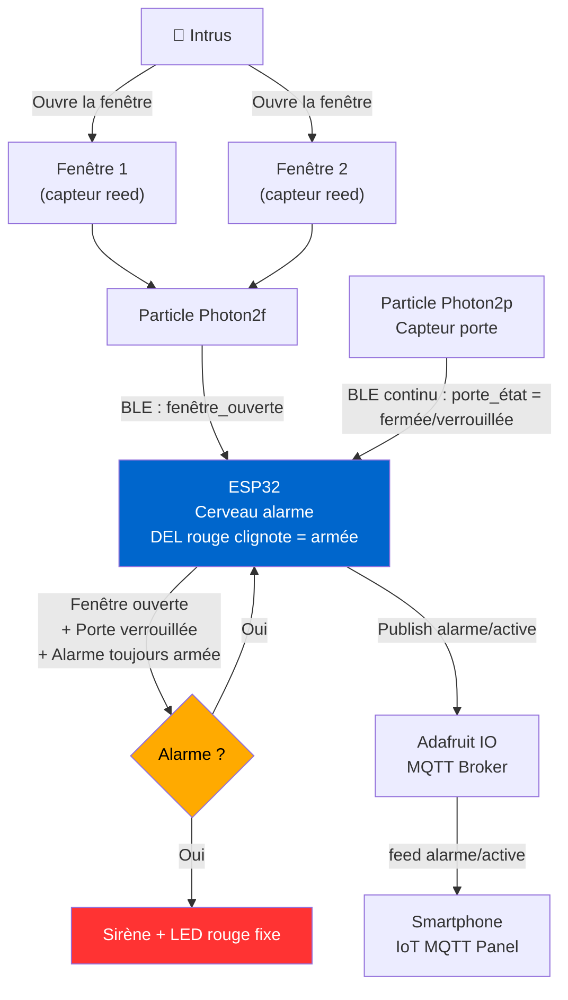
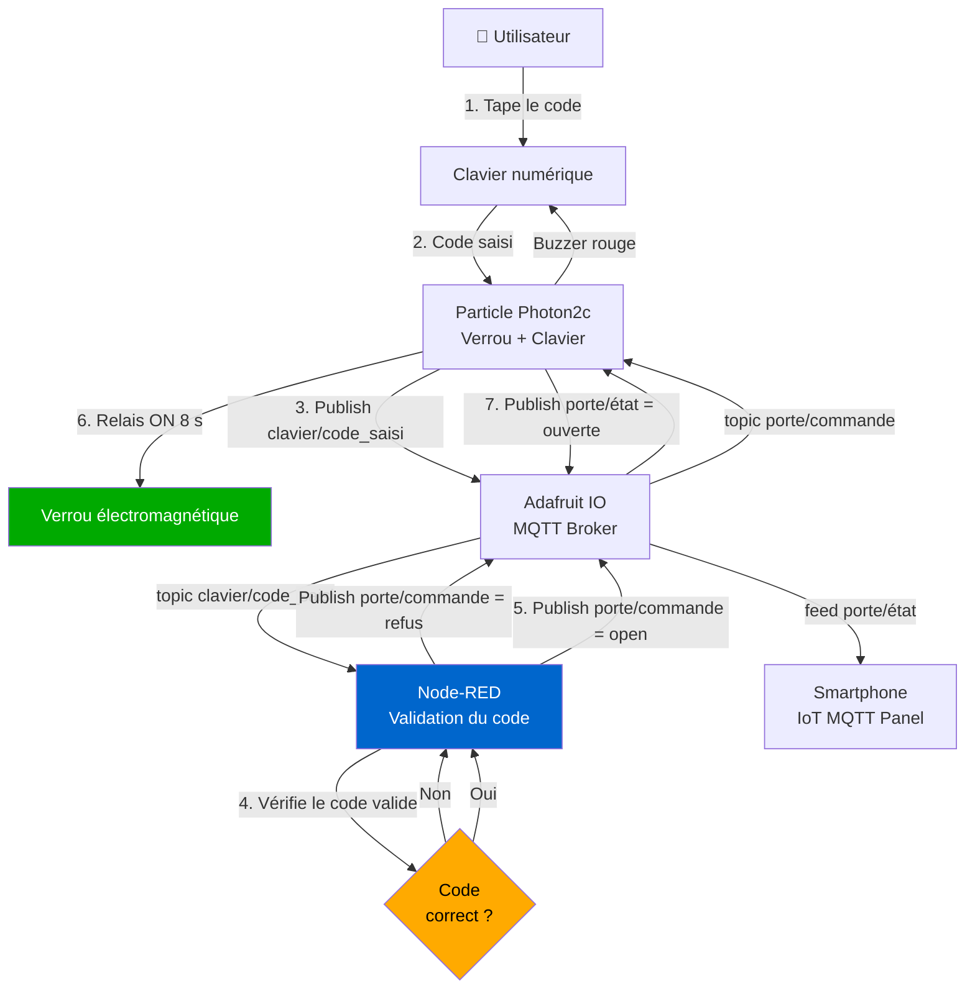
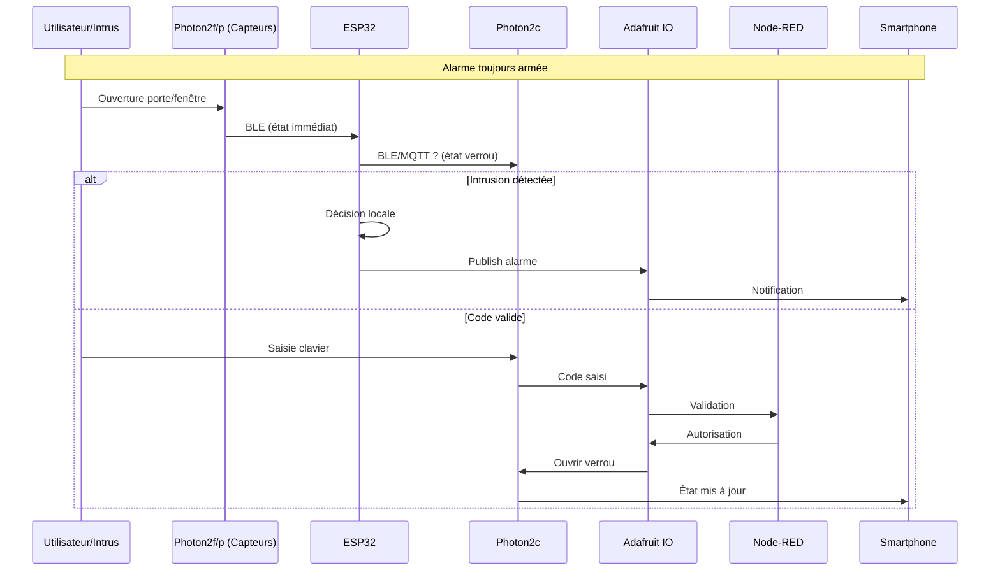
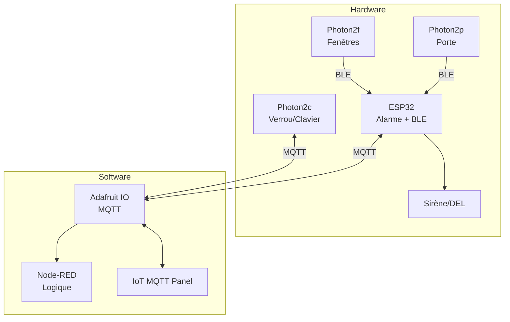

# Wiki : Maison Intelligente (Projet Maison2)

Bienvenue sur le wiki du projet **Maison Intelligente**, un système domotique sécurisé basé sur des microcontrôleurs ESP32 et Particle Photon 2. Ce projet vise à sécuriser une habitation en intégrant des capteurs pour portes/fenêtres, un système d'alarme, un verrouillage intelligent et des notifications via MQTT. Le système utilise une architecture décentralisée avec communications BLE (Bluetooth Low Energy) pour les capteurs locaux et MQTT pour la centralisation via Adafruit IO.

Ce wiki est structuré en sections pour une navigation facile. Tous les codes sources sont disponibles dans le [repository GitHub FV4007A41Centurion/Maison2](https://github.com/FV4007A41Centurion/Maison2). Le projet est open-source sous licence MIT (vérifiez le README pour détails).

## Aperçu Général
Le système inclut :
- **Contrôleurs** : ESP32 (cerveau central pour l'alarme), Particle Photon 2c (verrou + clavier), Photon 2p (porte), Photon 2f (fenêtres).
- **Communications** : BLE pour transmissions locales (faible latence), WiFi/MQTT bidirectionnel via Adafruit IO pour cloud et notifications.
- **Outils** : Node-RED pour logique métier et validation (ex. : codes clavier).
- **Sorties** : Alarme (DEL + sirène), notifications push via IoT MQTT Panel sur smartphone.
- **Alimentation** : 5V DC stable, avec protections (détails dans les outputs Altium).

L'alarme est toujours armée (DEL rouge clignote). Déclenchement si intrusion (fenêtre/porte ouverte) sans déverrouillage valide.

## Schéma Bloc Complet
Le schéma bloc global illustre l'architecture du système. Il montre les connexions entre capteurs, actionneurs et le cloud.

- **Lien vers le schéma SVG** : [Schéma Bloc Complet](https://github.com/FV4007A41Centurion/Maison2/blob/main/Github-page-content/sch%C3%A9ma-bloc.svg)  
  (Téléchargez pour visualisation interactive ; généré avec Draw.io ou similaire).

**Description brève** (basée sur l'architecture) :  
Le bloc central est l'ESP32 connecté à la sirène/DEL alarme. Les Photon 2p/2f envoient des données BLE (état porte/fenêtres) à l'ESP32. Le Photon 2c gère le clavier/verrou et communique via MQTT. Adafruit IO sert de broker, avec Node-RED pour processing. Flux : Capteurs → BLE → ESP32 (décision locale) → MQTT → Notifications.

## Schémas de Use Cases
Voici les deux use cases principaux, modélisés en diagrammes de flux (Mermaid). Copiez le code pour rendu dynamique (ex. : sur mermaid.live).

### Use Case 1 : Déclenchement de l'Alarme (Fenêtre Ouverte + Porte Verrouillée)
L'alarme sonne si une fenêtre s'ouvre alors que la porte est verrouillée (état reçu en BLE continu). Pas de vérification "armée" car toujours active.

**Flux détaillé** :
1. Ouverture fenêtre → Photon2f → BLE → ESP32.
2. ESP32 (connaît état porte via BLE de Photon2p) → Décision locale.
3. Déclenchement sirène + publication MQTT → Notification smartphone.

### Use Case 2 : Déverrouillage de la Porte avec Code Valide
Validation du code clavier via Node-RED (centralisée). Si OK, ouverture verrou + log.

**Flux détaillé** :
1. Saisie code → Photon2c → MQTT → Node-RED.
2. Validation → Si OK, commande MQTT → Ouverture verrou.
3. État publié → Accès smartphone via IoT MQTT Panel.

## Autres Schémas Pertinents
- **Diagramme de Séquence Global** (nouveau, pour visualisation des timings) : Montre les interactions chronologiques (BLE rapide vs MQTT asynchrone).

- **Diagramme de Composants** (UML-style) : Pour hardware/software.

Ces schémas sont applicables pour extension (ex. : ajout capteur mouvement).

## Outputs d'Altium Designer
Les fichiers de conception PCB et schémas électriques sont disponibles dans ce PDF exporté d'Altium Designer. Il inclut :
- Schémas de câblage pour ESP32 et Photons.
- Layout PCB pour modules (alimentation 5V, relais verrou, capteurs reed).
- Listes de composants (BOM) : ESP32-WROOM, Particle P2, relais 5A, etc.
- Notes sur intégration : Blindage EMI pour BLE, fusibles protection.

- **Lien vers le PDF** : [Maison_Intelligente.pdf (Altium Outputs)](https://github.com/FV4007A41Centurion/Maison2/blob/main/Github-page-content/Maison_Intelligente.pdf)  
  (Ouvrez avec Adobe Reader pour zoom interactif ; 12 pages, incluant routage et silkscreen).

## Code Source et Implémentation
Tous les codes sont dans le [repository GitHub](https://github.com/FV4007A41Centurion/Maison2). Structure typique :
- `/firmware/esp32/` : Code Arduino pour ESP32 (alarme.ino, BLE_handler.cpp).
- `/firmware/photon2c/` : Code Particle pour verrou/clavier (verrou.cpp, mqtt_publish.cpp).
- `/firmware/photon2p/` : Capteur porte (ble_sender.cpp).
- `/firmware/photon2f/` : Capteurs fenêtres (multi_reed.cpp).
- `/flows/node-red/` : Fichiers JSON pour flows (validation_code.json, notifications.json).
- `/config/mqtt/` : Config Adafruit IO (feeds.yaml).

**Liens directs** :
- [Code ESP32 Alarme](https://github.com/FV4007A41Centurion/Maison2/tree/main/firmware/esp32)
- [Code Photon2c Verrou](https://github.com/FV4007A41Centurion/Maison2/tree/main/firmware/photon2c)
- [Flows Node-RED](https://github.com/FV4007A41Centurion/Maison2/tree/main/flows/node-red)

Pour build : Utilisez Arduino IDE pour ESP32, Particle Workbench pour Photons. README inclut instructions setup MQTT.

## Glossaire
| Terme | Description |
|-------|-------------|
| BLE | Bluetooth Low Energy : Communication locale rapide entre capteurs et ESP32. |
| MQTT | Protocole publish/subscribe via Adafruit IO pour cloud. |
| Node-RED | Outil low-code pour flux (validation codes, logs). |
| Reed | Capteur magnétique pour détection ouverture (portes/fenêtres). |
| IoT MQTT Panel | App mobile pour monitoring/subscription aux feeds Adafruit. |

## Annexes
- **Évolutions futures** : Ajout caméra, IA pour détection anomalies.
- **Dépannage** : Vérifiez BLE pairing ; logs MQTT dans Adafruit dashboard.
- **Contact** : Issues GitHub pour contributions.

Ce wiki est maintenu via GitHub Wiki. Mises à jour : Dernière le 24/11/2025. Contributions bienvenues !